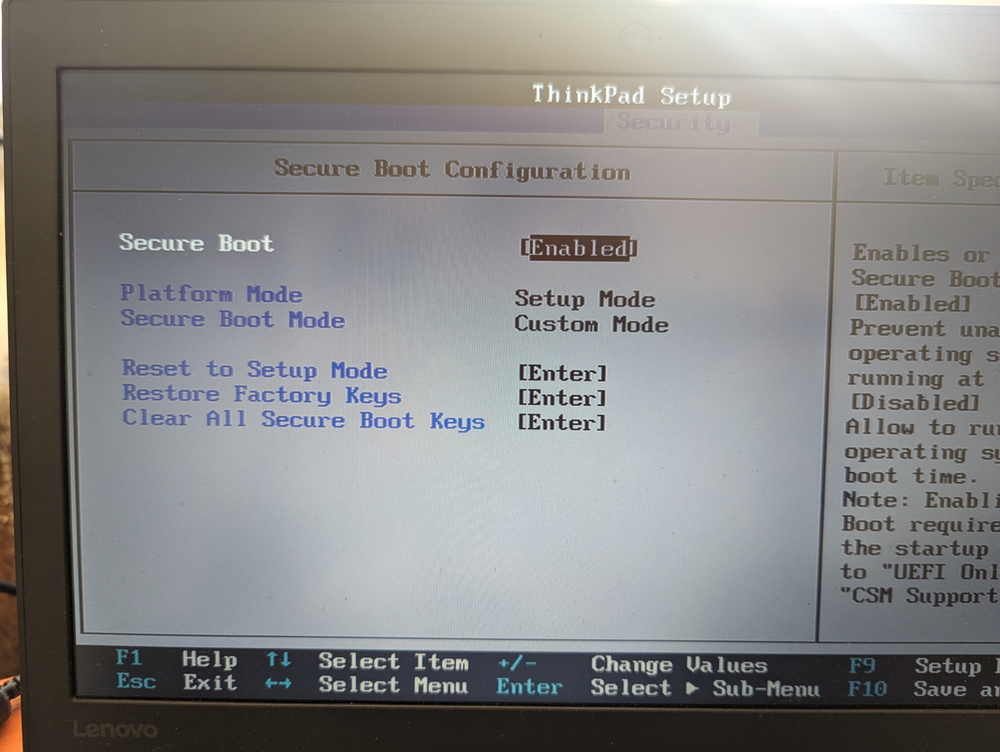

# Secure Boot

Secure Boot is a server security feature that is implemented in the BIOS and does not require special hardware. Secure Boot ensures that each component launched during the boot process is digitally signed and that the signature is validated against a set of trusted certificates embedded in the UEFI BIOS.

Tower OS-Thin Client offers the possibility to activate Secure Boot. To do this, the firmware must be correctly configured before and after installation.

## Before the installation

You must:

- disable Secure Boot if necessary
- Reset to "Setup Mode"
- Clear all secure boot keys already registered.

On Thinkpad firmware these three things can be done on the same screen:

## After the installation

You must enable the "Secure Boot" in the same screen.

Attention, once activated you will not be able to boot on unsigned devices, for example a live system on a USB key. It will first be necessary to deactivate the "Secure Boot".

Remember to make a backup of the private keys used for Secure Boot. They are located here: /usr/share/secureboot/keys/