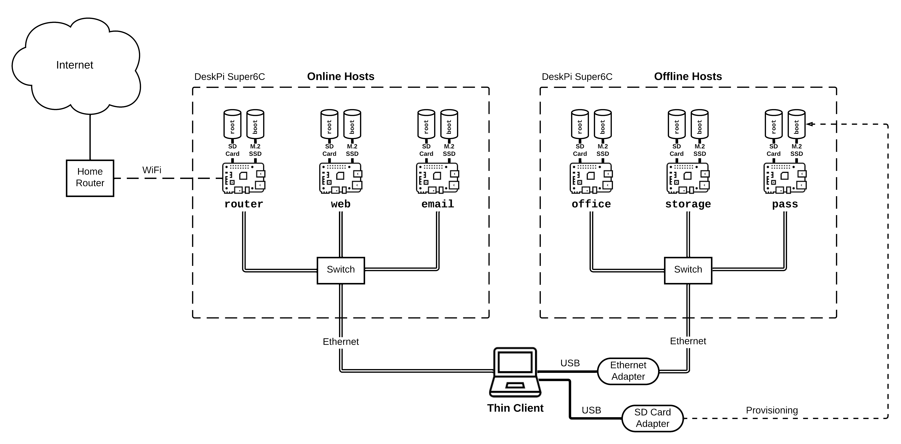
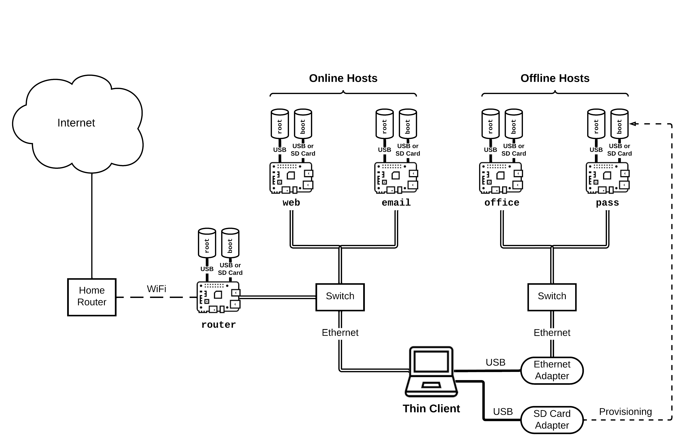

# Hardware

The architecture of TowerOS requires a significant amount of computer hardware to run: a thin client device, multiple host devices, networking hardware (depending on the host configuration) and various adapters and cables to connect everything together. A TowerOS system is, consequently, not as portable as a conventional personal computing system, but its developers are working on increasing physical portability.

## Thin Client
- The thin client is typically a laptop like a Lenovo X270, but any x86 device will work if it has a screen and keyboard.
- If you are using any Compute Modules for the hosts, then the thin client should have an SD card reader for provisioning SD cards that the hosts will boot from. (Raspberry Pi 4B/5s may be booted from USB keys, however.)
- The thin client should also have one or two RJ-45 ports, depending on the number of networks in use (online-only, or one for online hosts and one for offline hosts).
- A USB-Ethernet adapter, if the thin client doesn't have a built-in Ethernet port. (Recommended: [Olimex USB Ethernet Adapter](https://www.olimex.com/Products/USB-Modules/USB-GIGABIT/open-source-hardware)
- Finally, you will need a dedicated USB key to serve as the boot device for the thin client.

## Hosts
TowerOS currently supports two kinds of host hardware: **Raspberry Pi 4B** or **Raspberry Pi 5** and **Raspberry Pi Compute Module 4 Lite** (“**CM4**” for short). Whereas Raspberry Pi 4B/5s must be connected with standalone switch hardware, CM4 modules may be connected with a board like the DeskPi Super6C, which provides for a much more compact form factor for a complete TowerOS system. CM4 modules may use M.2 SSDs as their persistent storage with a DeskPi Super6C, and they should therefore perform much better than Raspberry Pi 4Bs, which are limited to USB transfer speeds. (Raspberry Pi 5s have an external PCIe port, however, and so may also use SSDs for their storage without being bottlenecked by the USB interface.)

- *Each host needs two storage devices to function properly*: one for the boot filesystem and another for the root filesystem (the one that contains your applications and data).
- The amount of RAM required for each host is heavily dependent on the intended usage pattern. Generally, at least one host should have 8GB of RAM, so that it can run a web browser comfortably. For the router host, we recommend having at least 2GB of RAM.
    - The decryption key for the root filesystem is stored directly on the boot device, so the user may remove this device when leaving the host hardware unattended to protect against physical data theft.
- Different SD cards and USB keys may have very different performance characteristics. In general, USB keys are much faster than SD cards, and SSDs are faster still.

### Configuration — Compute Module 4 Lite

Using CM4s and the [DeskPi Super6C Board](https://deskpi.com/collections/deskpi-super6c/products/deskpi-super6c-raspberry-pi-cm4-cluster-mini-itx-board-6-rpi-cm4-supported) you can avoid most cables and put all your hosts in a single mini-ITX case. This setup is generally **more performant, more affordable and more compact**. However, it is also more difficult to debug: the DeskPi only provides USB and HDMI access to slot #1 on the board, and hosts cannot be power cycled individually. To support both online and offline hosts, two independent DeskPi Super6s should be used; otherwise, a single DeskPi will support five online hosts plus the router.

#### Requirements
- Only the CM4 *Lite* is supported.
- The CM4 module used for the router must have on-board WiFi; the others may be wireless. (With the DeskPi, it's possible to disable wireless connectivity for each CM4 with a jumper.)
- CM4s must be booted from an SD card, which will contain the boot partition.
- Accordingly, you must have an SD Card reader for the thin client.
- When using a DeskPi Super 6C, you must use an SD card for the boot file system and an M.2 SSD for the root file system.

### Configuration — Raspberry Pi 4B or 5

Using standard Raspberry Pi 4B/5s for your system is most appropriate if it does not need to be portable, because of the additional bulk of the Raspberry Pi form factor. If you wish to support offline hosts, then you need two unmanaged switches; otherwise, one will do.

#### Requirements
- If your system is based on Raspberry PI 4B/5s, you can use either an SD card or a USB key for each file system. Note: The speed of the root file system will have a significant impact on overall system performance. With the Raspberry Pi 4B, getting the best performance requires that a fast USB drive be used for the root file system and that it be connected _via_ the blue USB 3.0 port.
- One Ethernet cable per host
- One unmanaged (gigabit) switch per host network
- If you are using a PoE switch, you will need one PoE hat per host; if not, a USB hub may be used for power delivery.
- If you are using a Raspberry Pi 5 and want to boot from a USB key, then you must use a 5V 5A power supply.

## Additional Hardware for Debugging
* Monitor for Hosts
* micro HDMI Adapter
* USB Keyboard for Hosts
* USB Mouse for Hosts
