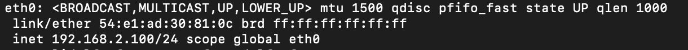
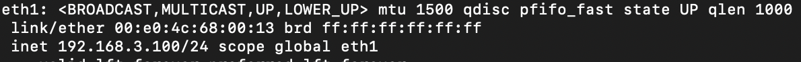
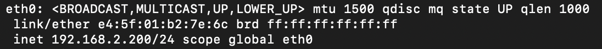
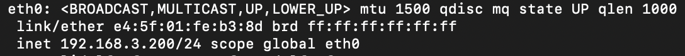
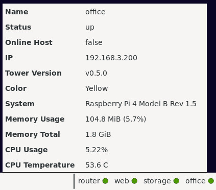

## Manually QA TowerOS

### TowerOS-ThinClient Installation

| Feature | Action | Result |
| ------- | ------ | ------ |
| Disk is fully encrypted. | Restart without the USB key containing the `boot` partition. | Doesn't Boot. |
| | Restart with the USB key containing the `boot` partition. | Boots to Welcome Message. |
| The welcome message is displayed. | Check the message above the login prompt. | A message should indicate the location of the documentation. |
| Default user is created. | Enter the chosen username and password. | You should log in. |
| Keyboard is configured. | Type some characters. | Check is OK. |
| Time Zone is configured. | `[thinclient]$ date` | The date with the correct time zone. |
| Shell prompt is customized. | Check the shell prompt format. | `[<username>@thinclient <current folder>]$` |
| The `swap` partition must be 8Gb, the `home` partition must occupy 20% of the rest, and the `root` partition the remaining space. | `[thinclient]$ lsblk` |  |
| `supercronic` service must be started. | `[thinclient]$ sudo rc-service supercronic status` | `* status: started` |
| Default user is sudoer without password. | `[thinclient]$ sudo su` | Root session without a password being requested. |
| The documentation must be present in the ~/docs folder. | `[thinclient]$ ls ~/docs` | List of documents. |
| Documentation can be consulted with `bat`. | `[thinclient]$ bat ~/docs/usage.md` | Markdown viewer. |
| Tower CLI man page is installed. | `[thinclient]$ man tower` | Tower CLI manual. |
| `eth0` must be configured with IP `192.168.2.100`. | `[thinclient]$ ip ad` |  |
| `eth1` must be configured with IP `192.168.3.100`. | `[thinclient]$ ip ad` |  |
| `eth0` MAC must be persistent. | `[thinclient]$ ip ad`, reboot then `[thinclient]$ ip ad`. | The value of `link/ether` for `eth0` should not change after a reboot. |
| `iptables` service must be started. | `[thinclient]$ sudo rc-service iptables status` | `* status: iptables` |
| Firewal must be correctly configured. | `[thinclient]$ sudo iptables -L -v` | [See configuration](https://github.com/towercomputers/toweros/blob/master/tower-lib/toweros-installers/toweros-thinclient/installer/configure-firewall.sh). |
| Wifi must be soft blocked. | `[thinclient]$ rfkill list wifi` | `Soft blocked: yes` |
| Bluetooth must be soft blocked. | `[thinclient]$ rfkill list bluetooth` | `Soft blocked: yes` |
| `labwc` starts automatically after login if the option was chosen during installation. | Boot. | `labwc` must start after login. |
| `labwc` should properly start manually with `startw` alias. | `[thinclient]$ startw` | `labwc` must start. |
| `labwc` auto start should be configurable. | Edit the `STARTW_ON_LOGIN` value in `~/.local/tower/osconfig` to "true" and reboot. | `labwc` should start after login. |
| `labwc` auto start should be configurable. | Edit the `STARTW_ON_LOGIN` value in `~/.local/tower/osconfig` to "false" and reboot. | `labwc` should not start after login. |
| The wallpaper should be correctyly displayed | Check the wallpaper. | Tower's logo. |
| The `sfwbar` menu bar should appear correctly. | `[thinclient]$ dbus-launch labwc` | Menu bar must be present on the bottom. |
| `CopyQ` must be correctly started. | Check the presence of the icon in the taskbar. |  |
| Wallpaper should be configurable. | Edit the `WALLPAPER_IMAGE` value in `~/.local/tower/osconfig` and restart `labwc`. | Wallpaper must change. |
| When `labwc` is open, the screen locker should activate correctly after 5 minutes of inactivity. | Stay inactive 5mn. | Black screen with password prompt. |
| In the terminal, the screen locker should activate correctly after 5 minutes of inactivity. | Exit `labwc` and stay inactive 5mn. | Black screen with password prompt. |
| Screen locker timeout should be configurable. | Edit the `LOCK_SCREEN_AFTER` value in `~/.local/tower/osconfig` and make the two previous tests. | Black screen with password prompt. |
| The latest version of `tower` cli must be installed. | `[thinclient]$ tower version`| Installed version. |
| Tower CLI autocompletion should work correctly. | `[thinclient]$ tower p` then `[tab]` | `[thinclient]$ tower provision` |
| Laptop should suspend on lid close | Close and re-open the lid | The laptop should be suspended and `physlock` activated on resume. |
| Power-off button should work. | Press the power-off button. | TowerOS should shutdown. |
| Sound must work. | `[thinclient]$ pw-cat -p /var/towercomputers/sample.flac ` | You must hear something. |

### Hosts provisioning

| Feature | Action | Result |
| ------- | ------ | ------ |
| `router` provisioning. | `[thinclient]$ tower provision router –wlan-ssid <ssid> –wlan-password <password>` | `router` is correctly provisioned |
| Online host provisioning. | `[thinclient]$ tower provision web --online` | `web` is correctly provisioned |
| Offline host provisioning. | `[thinclient]$ tower provision office --offline` | `office` is correctly provisioned |
| Disk is fully encrypted. | Restart hosts without the USB key containing the `boot` partition. | Doesn't Boot. |
| | Restart with the USB key containing the `boot` partition. | Boots correctly. |
| All hosts must be `up` | `[thinclient]$ tower status` | Should display all hosts with status `up`. |
| SSH must be configured | `[thinclient]$ ssh <host>` | Open a SSH session without requesting password |
| Host keyboard is configured. | Plug a keyboard and a screen into the host and type some characters. | Check is OK. |
| Default user is created. | `[thinclient]$ ssh <host> 'echo $USER'` | Shows the same default user as the thinclient. |
| Time Zone is configured. | `[thinclient]$ ssh <host> date` | The date with the same time zone as the thinclient. |
| Online hosts must be connected. | `[thinclient]$ ssh web ping www.google.com` | Ping result. |
| Offline hosts must not be connected. | `[thinclient]$ ssh office ping www.google.com` | `ping: bad address 'www.google.com'` |
| `iptables` service must be started. | `[thinclient]$ ssh <host> 'sudo rc-service iptables status'` | `* status: iptables` |
| Firewal must be correctly configured. | `[thinclient]$ ssh <host> 'sudo iptables -L -v'` | [See configuration](https://github.com/towercomputers/toweros/blob/master/tower-lib/toweros-installers/toweros-host/installer/configure-firewall.sh). |
| `eth0` must be configured on the network `192.168.2.0/24` for online hosts | `[thinclient]$ ssh web ip ad` |  |
| `eth0` must be configured on the network `192.168.3.0/24` for offline hosts | `[thinclient]$ ssh office ip ad` | `[thinclient]$ ssh web ip ad` |  |
| On the `router` the MAC of `wlan0` must be different at each startup. | `[thinclient]$ ssh router ip ad`, reboot the `router`, then `[thinclient]$ ssh router ip ad`. | The value of `link/ether` for `wlan0` should change after each reboot. |
| The `home` partition must occupy 20% and the `root` partition the remaining space. | `[thinclient]$ ssh <host> lsblk` |  |
| Shell prompt is customized. | `[thinclient]$ ssh <host>` | `[<username>@<host> <current folder>]$` |
| Each host has a different shell color. | `[thinclient]$ ssh <host>` on all hosts. | The prompt colors are different. |
| Wifi must be soft blocked on all hosts except the `router`. | `[thinclient]$ ssh <host> rfkill list wifi` | `Soft blocked: yes` |
| Wifi must not be soft blocked on the `router`. | `[thinclient]$ ssh router rfkill list wifi` | `Soft blocked: no` |
| Bluetooth must be soft blocked on all hosts. | `[thinclient]$ ssh <host> rfkill list bluetooth` | `Soft blocked: yes` |
| Default user is sudoer without password. | `[thinclient]$ ssh <host> sudo su` | Root session without a password being requested. |
| Tower widget must be correctly started. | Check the presence of the widget in the taskbar. |  |
| Clicking on the name of a host in the taskbar displays the host information. | Click on the name of one of the hosts |  |
| Tower widget should display down hosts in red. | Turn off one of the hosts and check the taskbar.|  |
| Offline host time should be synchronized with `router` time. | `[thinclient]$ ssh router date && ssh office date` | The same date and time. |

### Execution and installation of applications

Once the `router` is installed:

| Feature | Action | Result |
| ------- | ------ | ------ |
| APK packages can be installed on the Thin Client | `[thinclient]$ tower install thinclient fortune` `[thinclient]$ fortune` | Random message. |
| APK packages can be installed on online host | `[thinclient]$ tower install web fortune` `[thinclient]$ fortune` | Random message. |
| APK packages can be installed on offline host | `[thinclient]$ tower install office fortune` `[thinclient]$ fortune` | Random message. |
| Once installed, graphical applications should appear in the `sfwbar` menu with icons. | `[thinclient]$ tower install office galculator` then check the taskbar menu. |  |
| In the taskbar menu each host is differentiated by a colored circle. | check the taskbar menu. |  |
| Host shell prompt color matches with the menu. | `[thinclient]$ ssh <host>` | Prompt color should be the same as the circle in the menu. |
| SSH welcome message is disabled. | `[thinclient]$ ssh <host>` | No message before the prompt. |
| Graphical applications can be launched via the `sfwbar` menu.  | Click on the desired application. | Application should be launched. |
| Graphical applications can be launched via the terminal.  | `[thinclient]$ tower <host> run <application>` | Application should be launched. |
| Copy/past is possible between two hosts. | Open two graphicals application on two different host and try a copy/past. | Past must work. |
| Online applications must work correctly on online hosts. | `[thinclient]$ tower web install midori` `[thinclient]$ tower web run midori` | You can browse the web. |
| `tor` proxy is enabled for online host. | `[thinclient]$ ssh web curl --socks5 192.168.2.1:9050 https://check.torproject.org/api/ip` | `{"IsTor":true,"IP":"109.70.100.71"}` |
| The time on online hosts must be correct. | `[thinclient]$ ssh web date` | The correct date and time. |

### TowerOS-ThinClient Upgrade

In addition to all the points listed for installing TowerOS-ThinClient:

| Feature | Action | Result |
| ------- | ------ | ------ |
| the new version of `tower` cli must be installed. | `[thinclient]$ tower version` | The new version. |
| All previously installed hosts must be accessible. | `[thinclient]$ tower status` | List of previously installed hosts. |
| The `sfwbar` menu must display all applications previously installed on the hosts. | Check the taskbar menu. | Previously installed applications must be here. |
| The `sfwbar` widget indicating the host status must include all the hosts. | Check the taskbar. |  |
| The contents of the home partition must be completely preserved. | `[thinclient]$ ls ~/` | The same content as before the upgrade. |

### Host Upgrade

In addition to all the points listed for Hosts provisioning:

| Feature | Action | Result |
| ------- | ------ | ------ |
| The new version of TowerOS-Host must be installed. | `[thinclient]$ tower status <host>` | The new version. |
| All applications installed with `tower install` must be reinstalled. | Check the taskbar menu. | Previously installed applications must be here. |
| The contents of the home partition must be completely preserved. | `[thinclient]$ ssh <host> ls ~/` | The same content as before the upgrade. |
